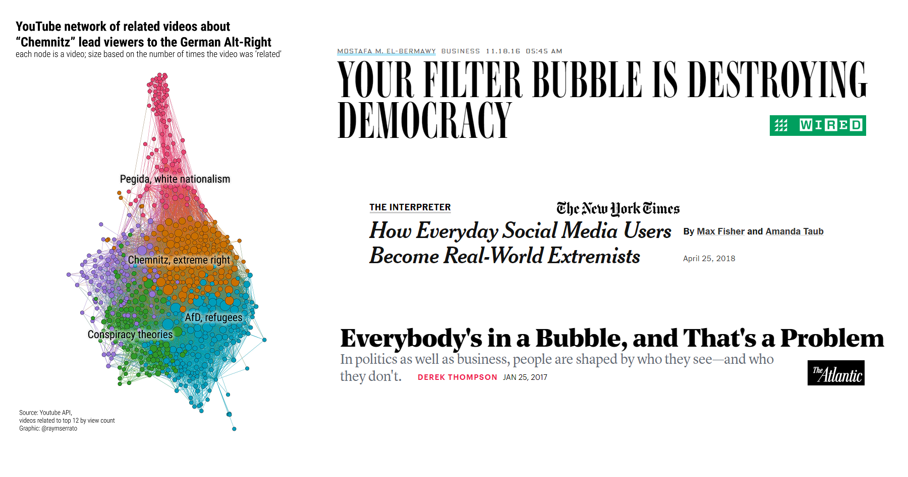
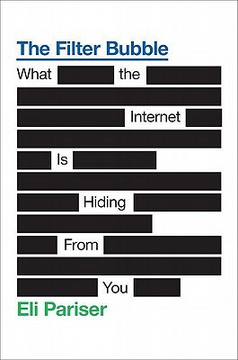
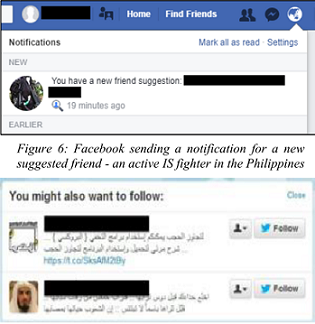
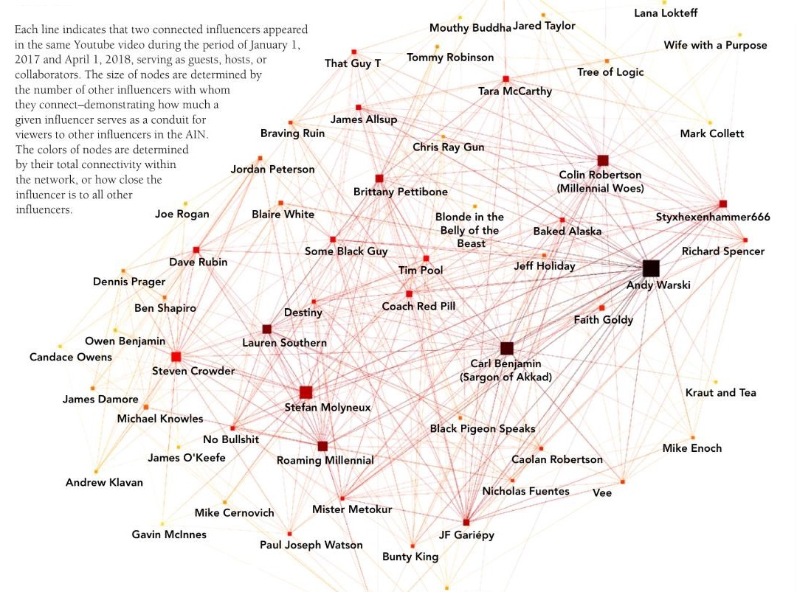
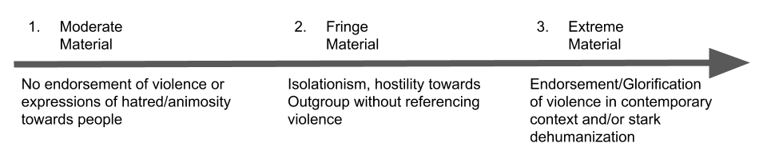
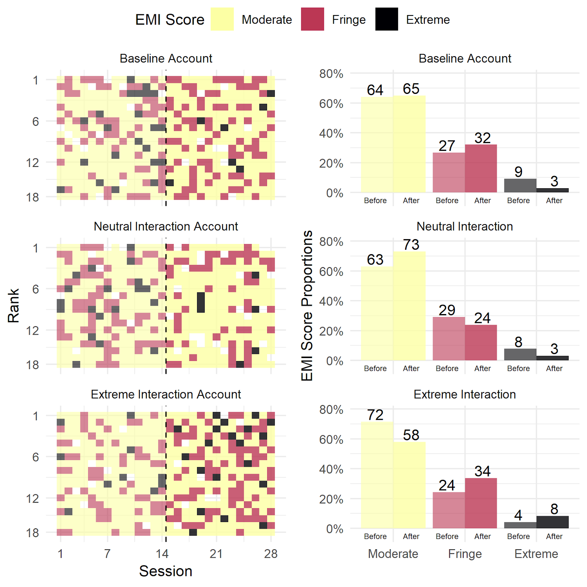
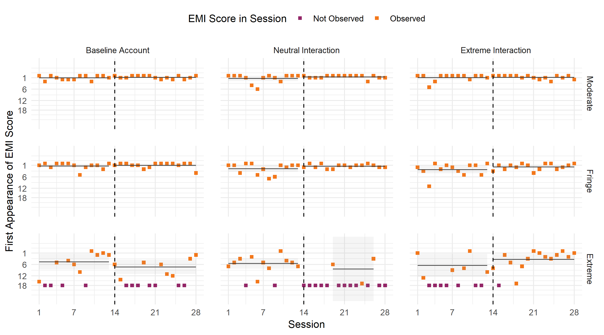
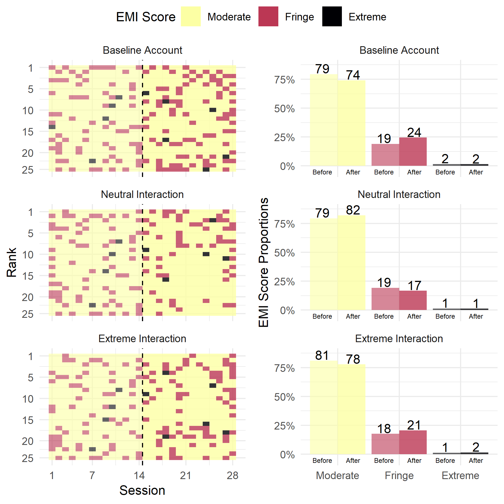
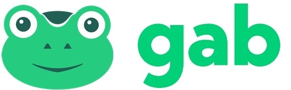

## Overview

+ Personalisation Algorithms & Filter Bubbles

+ Research so far

+ Filter Bubbles and Extremism

+ Research Question & Design

+ Results

+ Conclusions & Recommendations

+ Literature


---

class: center, middle, inverse

## What are Filter bubbles? 

### And what's the problem?

---

### What are Filter bubbles? 

<br>



---


### What are Personalisation Algorithms?

.pull-left[

<br>Pariser 2011
]


+ Algorithms are responsible for content that users see in their feeds 

+ Eli Pariser suggests that they can create a “filter bubble” effect or “autopropaganda”

+ by controlling what users do and do not see it can – and is in fact, designed to – dramatically amplify confirmation bias

+ The pre-filtering of content leads to bubbles in which people never view or read about opposing viewpoints

+ Creates seperated spaces that make communication between opposing viewpoints harder: undermines democracy itself


---


### What are Personalisation Algorithms?

<br>

The EU Group on Media Freedom and Pluralism notes that: 

> Increasing filtering mechanisms makes it more likely for people to only get news on subjects they are interested in, and with the perspective they identify with. It will also tend to create more insulated communities as isolated subsets within the overall public sphere. [...] Such developments undoubtedly have a potentially negative impact on democracy.

*Vīķe-Freiberga, Däubler-Gmelin, Hammersley, & Pessoa Maduro, 2013, p. 27*

<br>

**Filter bubbles are considered a concern at the highest level.**

---

class: center, middle, inverse

## Research so far

### and linking filter bubbles to extremism

---

### Research so far

The empirical evidence of a "filter bubble" effect is less clear and decidedly less pessimistic. 

+ Findings from a study on Facebook suggest filter bubbles are generated less by algorithms than by individual user decisions (Bakshy, Messing and Adamic, 2015). 

+ Research analysing Google news recommendation suggests essential information is not omitted (Haim, Graefe and Brosius, 2018) 

+ Personalised recommendations show no reduction in diversity over human editors (Möller et al., 2018). 

+ Finally, research on Google search results also finds factors such as time of search were more explanatory than prior behaviour and preferences (Courtois, Slechten and Coenen, 2018).

Why the discrepancy?

+ "Echo chamber about echo chambers" (Guess et al. 2018)

---


### Filter Bubbles and Extremism

There is a paucity of research studying the effects of personalisation algorithms on extremist content.

.pull-left[

]

+ Research on YouTube found that the recommender system could propel users into an immersive bubble of right-wing extremism within a few clicks (O’Callaghan et al., 2015)

+ Twitter’s “Who to Follow” recommendation was found to suggest violent extremist Islamist groups if the user followed al-Qaeda affiliate Jabhat al Nusra (Berger, 2013)

+ Facebook’s “Recommended Friends” function had likely actively connected at least two Islamic State supporters in South East Asia (Waters and Postings, 2018)

The architecture of the platforms may facilitate closer interactions than would otherwise exist.


---

```{r, echo = F}

```
<br>Becca Lewis 2018


---


class: center, middle, inverse

## Research Question and Design

---

### Research Question 

> Do algorithms promote extremist material once a user begins to interact with such content?


```{r, echo = F}

```

**Research Design**

+ Experimental design with accounts on YouTube and Reddit 

+ Let them interact with different kinds of content as treatment.

The following user types are suggested:

1. *Neutral Interaction Accounts* interact with neutral content 
2. *Extreme Interaction Accounts* interact with extreme content 
3. *Baseline Accounts* do nothing to establish a baseline

+ Pull timelines/recommendations of each bot two times a day.


---

### How to measure extremist content?

Multiple pathways:

+ Sentiment analysis can be used to identify extremist authors (Scrivens et al., 2018)

+ Topic models to identify (far-right) extremist content (O’Callaghan et al., 2015)

+ Hand-coding content for example with Holbrook's Extremist Media Index (Holbrook, 2015)

+ Manually labelled data can also be used as training dataset for machine learning models

Holbrooke's Extremism Media Index (2015)

```{r, echo = F}

```

---

### Expected Relationships

+ Frequency of extreme material increases after interacting with extreme content

+ Extreme content is prioritized by the algorithm when interacting with extreme material

**Methods**

+ Difference-in-Difference Estimation for treatment effects

+ Count data modeled with the help of (quasi-)poisson regression

+ Non-Parametric t-tests


---

class: center, middle, inverse

## Results

---

```{r, out.width=150, echo = F}

```

<br>

+ Created 3 identical accounts

+ Followed 10 XRW accounts; 10 Neutral

+ Visited the site twice per day for 2 weeks and collected data for the 18 Recommend Videos on the home page

+ Neutral Interaction Account interacted predominantly with *neutral content* after the first week

+ Extreme Interaction Account interacted predominately with *extreme content* after the first week.

+ Baseline Account continued to *not interact*.

+ Every piece of content gets a unique rank per session and an Extremist Media Index (EMI) Score (Holbrook, 2015)

+ Two individuals rated the content with a Krippendorff's alpha of 0.77

---


```{r, out.width=150, echo = F}

```

.pull-left[

]


.pull-right[

Of the 1443 videos coded on YouTube

+ 949 (65.77%) are rated as moderate
+ 409 (28.34%) were judged to be fringe 
+ 85 (5.89%) were deemed to be extremist 

Extreme content 2.47 (p < 0.01) times more likely than moderate

Extreme content ranked sig. higher (p < 0.028) than moderate.

]

Figures show the EMI scores for each session with a rank from one to eighteen, depending on where the video appears on the “Recommended Videos” section as well as the percentage distribution of the three categories of content before and after each treatment.


---

```{r, out.width=150, echo = F}

```

```{r, echo = F, warning = F, message=F}


```


---

```{r, out.width=150, echo = F}

```

<br>

+ Created 3 identical accounts

+ Followed 10 XRW subreddits; 10 Neutral

+ Visited the site twice per day for 2 weeks and collected data for the 25 “Popular” threads on the home page

+ Neutral Interaction Account interacted predominantly with *neutral content* after the first week

+ Extreme Interaction Account interacted predominately with *extreme content* after the first week.

+ Baseline Account continued to *not interact*.

+ Every piece of content gets a unique rank per session and an Extremist Media Index (EMI) Score (Holbrook, 2015)

+ Two individuals rated the content with a Krippendorff's alpha of 0.77

---

```{r, out.width=150, echo = F}

```


.pull-left[

]


.pull-right[

Of the 2100 posts coded on Reddit (834 unique)


+ 78.76% Moderate
+ 19.81% Fringe
+ 1.43% Extreme

No sig. observable prioritisation of any content

No sig. difference in the ranks

]


---

```{r, out.width=150, echo = F}

```

.pull-left[

]


.pull-right[


3 Different News Feeds: “Popular”, “Controversial”, and “Latest”

3 Topics: “Politics”, “News”, “Humour”

Collected data over three sessions

Coded against Holbrook’s (2015) Extremist media Index


1271 Rated posts (746 unique)

+ 63.73% Moderate
+ 28.8% Fringe
+ 7.47% Extreme


]

No statistically sig. difference between extreme content in any of the timelines


---


class: center, middle, inverse

## Conclusions & Future Research

---

### Conclusions & Recommendations


**Filling the research gap in terms of filter bubbles and extremism**

+ Research so far was mostly focused on news filter bubbles and only implicitly mentioned extremism or pathways into extremism

+ Evidence suggests that interaction with extremist content might lead you down a path of seeing more and more extreme content

**Improvements to already conducted study**

+ More accounts, Longer period
    + Control for likes, shares, views etc.

+ Use computational methods to measure extremism

+ Additional Research Question:

> Does changing online behavior successfully change the content that algorithm recommendations prioritize or do they inhibit change?

---

### Conclusions & Recommendations


**Linking research to real-life implications:**

+ The psychological aspects of how long it takes people to be influenced by content, or what type of content is the most influential would be a opportunity to supplement the research in a case study


**Recommendations**

+ Limited features/demonetise

+ Transparency – “Why have I been recommended this?”

+ More research – especially on closed platforms

+ CVE approaches – Redirection


---

class: center, middle, inverse

### Thank you for listening!


---

## Literature

Bakshy, E., Messing, S., & Adamic, L. A. (2015). Exposure to ideologically diverse news and opinion on Facebook. Science, 348(6239), 1130-1132.

Courtois, C., Slechten, L., & Coenen, L. (2018). Challenging Google Search filter bubbles in social and political information: Disconforming evidence from a digital methods case study. Telematics and Informatics, 35(7), 2006-2015.

Guess, A., Lyons, B., Nyhan, B., & Reifler, J. (2018). Avoiding the echo chamber about echo chambers: Why selective exposure to like-minded political news is less prevalent than you think. Document of the Knight Foundation. Retrieved from: https://www.researchgate.net/publication/330144926_Avoiding_the_echo_chamber_about_echo_chambers_Why_selective_exposure_to_like-minded_political_news_is_less_prevalent_than_you_think

Haim, M., Graefe, A., & Brosius, H. B. (2018). Burst of the filter bubble? Effects of personalization on the diversity of Google News. Digital Journalism, 6(3), 330-343.


---

## Literature


Holbrook, D. (2015). Designing and Applying an ‘Extremist Media Index’. Perspectives On Terrorism, 9(5). Retrieved from http://www.terrorismanalysts.com/pt/index.php/pot/article/view/461

Lewis, R. (2018). Alternative influence: Broadcasting the reactionary right on YouTube. Data & Society, Sept, 18.

Möller, J., Trilling, D., Helberger, N., & van Es, B. (2018). Do not blame it on the algorithm: an empirical assessment of multiple recommender systems and their impact on content diversity. Information, Communication & Society, 21(7), 959-977.

Pariser, E. (2011). The filter bubble: What the Internet is hiding from you. Penguin UK.

Vīķe-Freiberga, V., Däubler-Gmelin, H., Hammersley, B., Pessoa Maduro, L.M.P. (2013). A free and pluralistic media to sustain European democracy. Retrieved from http://ec.europa.eu/digital-agenda/sites/digital-agenda/files/HLG%20Final%20Report.pdf


---


### Facebook adds "Why am I seeing this" to posts


[Source: Facebook Newsroom, 31st March 2019](https://newsroom.fb.com/news/2019/03/why-am-i-seeing-this/)

---

### Selective Exposure

This means that people tend to 

+ select content (selective exposure),
+ interpret it (selective perception) and 
+ later better remember the information (selective retention) 

that is in line with their already existing ideas (cf. Zillmann and Bryant 1985)

