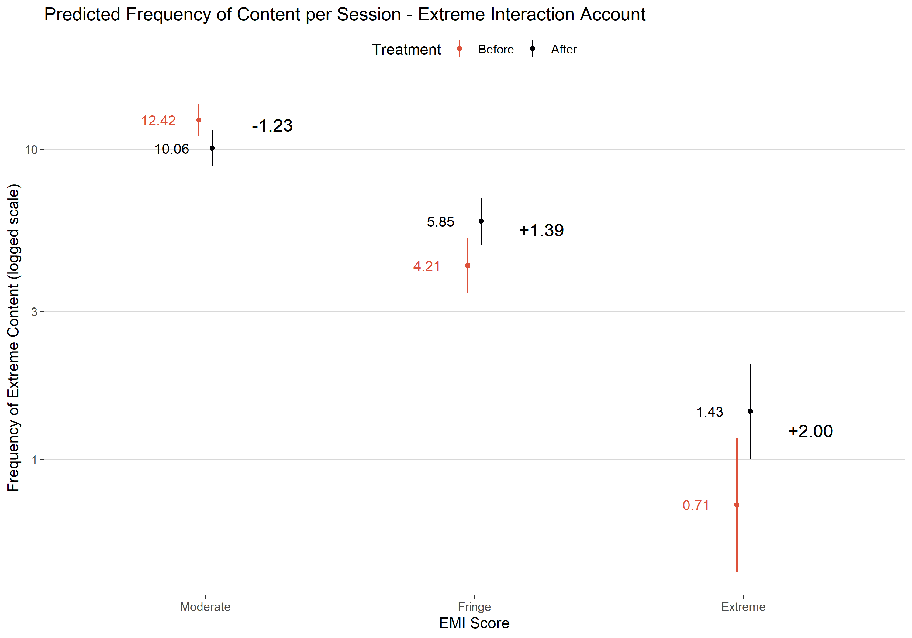
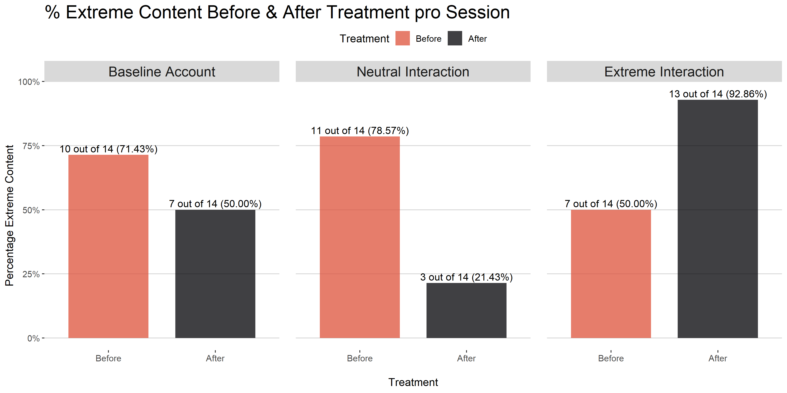
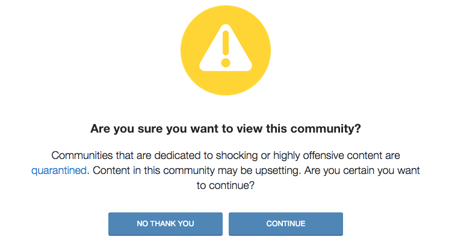
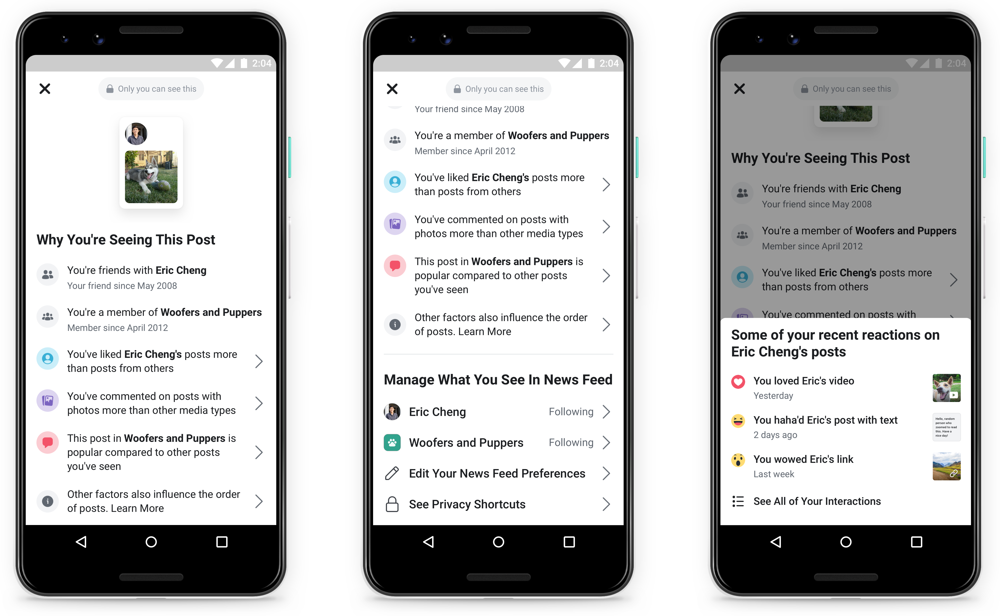

class: center, middle, inverse

## What are Filter bubbles? 

### And what's the problem?

<style>
.onehundredtwenty {
  font-size: 120%;
   }

<style>
.ninety {
  font-size: 90%;
   }
   
.eightyseven {
  font-size: 87%;
   }

.eightyfive {
  font-size: 85%;
   }
   
.eighty {
  font-size: 80%;
   }
   
.seventyfive {
  font-size: 75%;
   }
   
.seventy {
  font-size: 70%;
   }
</style>


---

### What are Filter bubbles? 

<br>


---

class: center, middle, inverse

## Research so far

### and linking filter bubbles to extremism

---

### Research so far

The empirical evidence of a "filter bubble" effect is less clear and decidedly less pessimistic. 

+ Study on Facebook suggests filter bubbles are generated less by algorithms than by individual user decisions (Bakshy, Messing and Adamic, 2015). 

+ Research analysing Google news recommendation suggests essential information is not omitted (Haim, Graefe and Brosius, 2018) 

+ Personalised recommendations show no reduction in diversity over human editors (Möller et al., 2018). 

+ Research on Google search results also finds factors such as time of search were more explanatory than prior behaviour and preferences (Courtois, Slechten and Coenen, 2018).

Why the discrepancy?

+ "Echo chamber about echo chambers" (Guess et al. 2018)

---


### Filter Bubbles and Extremism

There is a paucity of research studying the effects of personalisation algorithms on extremist content.

.pull-left[

]

.eightyseven[

<br>

+ YouTube's recommended videos can propel users into an immersive bubble of right-wing extremism (O’Callaghan et al., 2015)

+ Twitter’s “Who to Follow” suggested violent extremist Islamist groups if the user followed al-Qaeda affiliated group (Berger, 2013)

+ Facebook’s “Recommended Friends” function had likely actively connected at least two Islamic State supporters in SE Asia (Waters and Postings, 2018)

]

<br>
<br>
<br>

The architecture of the platforms may facilitate closer interactions than would otherwise exist.


---


class: center, middle, inverse

## Research Question & Design 

---

### Research Question

> Do algorithms promote extremist material once a user begins to interact with such content?


```{r, echo = F}
knitr::include_graphics("images/social_media_logos.png")
```

**How to measure extremist content?**

--

+ Hand-coding content with Holbrook's Extremist Media Index

Holbrook's Extremism Media Index (2015)

```{r, echo = F}

```

---

### Expected Relationships

+ Frequency of extreme material increases after interacting with extreme content

+ Extreme content is prioritized by the algorithm when interacting with extreme material

**Methods**

+ Count data modeled with (quasi-)poisson regression

+ Non-Parametric t-tests to estimate ranking differences


---

### Research Design


.eightyseven[

+ YouTube/Reddit Research design 
    + Created **THREE** identical accounts
    + All follow same 10 XRW channels/subreddtis; 10 Neutral
    + Each account interacts with different kinds of content
    
+ Collecting timelines *two times a day* for *two weeks* (28 sessions in total)
   + 2019-01-21 and ended on 2019-02-04

1. *Neutral Interaction Account* mostly interacts with neutral content (after a week)
2. *Extreme Interaction Account* mostly interacts with extreme content (after a week)
3. *Baseline Account* does nothing to establish a baseline

+ On YouTube:
   + Pull 18 Recommended Videos of each account
+ On Reddit:
   + 25 threads on the *“Best”* personalized timeline for each account

   
+ Every piece of content gets a unique rank per session and an Extremist Media Index (EMI) Score (Holbrook, 2015)

+ Satisfactory interrater reliability between two individuals  
    + Krippendorff's alpha: 0.77 across all platforms

]

---

class: center, middle, inverse

## Results


---


```{r, out.width=150, echo = F}
knitr::include_graphics("images/youtube.png")
```

.pull-left[

]


.pull-right[


Overview of the data:

Of the 1443 videos coded on YouTube (749 unique)

+ 65.77% moderate
+ 28.34% fringe 
+ 5.89% extremist 


]

.seventyfive[

Figure on the left shows the EMI scores for each session with a rank from one to eighteen, depending on where the video appears on the “Recommended Videos” section. Figure on the right shows the percentage distribution of the three categories of content before and after each treatment.

]


---

```{r, out.width=150, echo = F}
knitr::include_graphics("images/youtube.png")
```


```{r, echo = F, warning = F, message=F, out.height=400, out.width=600, fig.align='center'}


```


.seventyfive[

After **extreme interaction** treatment:

+ Fringe content 1.37 (p < 0.01) times more likely than before
+ Extreme content 2.00 (p < 0.01) times more likely than before

]

---

```{r, out.width=150, echo = F}
knitr::include_graphics("images/youtube.png")
```

```{r, echo = F, warning = F, message=F}


```


.seventyfive[

+ In the **neutral interaction account**
    + **only three sessions** had an extreme content piece after interaction 
+ In the **extreme interaction account** 
    + **all but one session** had an extreme content piece after interaction

]

---

```{r, out.width=150, echo = F}
knitr::include_graphics("images/youtube.png")
```

```{r, echo = F, warning = F, message=F, out.height=400, out.width=800, fig.align='center'}


```


.seventyfive[
 
+ In the **extreme interaction account**
    + Extreme content ranked sig. higher (p = 0.028) than moderate
    + Almost all extreme content shows up in the upper half (< 8) of the recommendations      
      (Median Rank = 5)

]


---

```{r, out.width=150, echo = F}
knitr::include_graphics("images/reddit-logo.jpg")
```


.pull-left[

]


.pull-right[

Of the 2100 posts coded on Reddit (834 unique)


+ 78.76% Moderate
+ 19.81% Fringe
+ 1.43% Extreme

No sig. observable prioritisation of any content

No sig. difference in the ranks

]


---

```{r, out.width=150, echo = F}

```

.pull-left[

]


.pull-right[


*Different setup due to technical difficulties*

3 Different News Feeds: “Popular”, “Controversial”, and “Latest”

3 Topics: “Politics”, “News”, “Humour”

Collected data over five sessions


1271 Rated posts (746 unique)

+ 63.73% Moderate
+ 28.8% Fringe
+ 7.47% Extreme


]

No statistically sig. difference between extreme content in any of the timelines


---


class: center, middle, inverse

## Discussion

---

### Discussion


.pull-left[
+ Only YouTube has an effect which, after engaging with extreme content, prioritises it further.

+ Users which engage with extreme and fringe content are more likely to be recommended more of the same. 

+ Extreme content is pushed up the ranking of recommended videos on YouTube 

+ Support for O’Callaghan et al. (2015)
]


.pull-right[


<br>


 


]

---

### Discussion


.pull-left[
+ Safe haven for right wing extremists and home to terrorists such as Pittsburgh Synagogue Shooter

+ Anecdotally, by far the most extreme of the platforms.

+ Lack of evidence of Gab’s algorithm suggests that it is the user’s choices which are responsible for this environment.

]


.pull-right[


 
<br>


]


---

class: center, middle, inverse

## Recommendations

---

### Recommendations

**Removing Problematic Content from Recommendations**

.pull-left[
+ Content which does not clearly violate site rules or policies

+ Google’s “limited features” policy

+ Reddit’s “Quarantine” System

+ Opt in content

+ No monetisation or recommendation

+ Constructive balance between freedom of speech and harmful content.

+ Need for Clarity and Consistency 
]

.pull-right[

<a href="https://oilab.eu/4chans-youtube-a-fringe-perspective-on-youtubes-great-purge-of-2019/">
  
</a>
.seventyfive[
[OILAB](https://oilab.eu/4chans-youtube-a-fringe-perspective-on-youtubes-great-purge-of-2019/): Availability of YouTube videos posted in Nazi threads on 4chan/pol/ on 5 and 6 June 2019.
]
]

---

### Recommendations

**Ensuring Video Recommendations are from Quality Sources**


.pull-left[
+ Provide users with more context and alternative perspectives

+ Google introduced changes to make quality count and give more context to searches.

+ Provide high quality sources on the same topic

+ Jigsaw’s redirect method as a model.
]


.pull-right[

]

---

### Recommendations

**Greater Transparency**


.pull-left[
+ Users should have a clear option to request why content has been recommended to them.

+ Opportunity for Explainable AI

+ Facebook’s “Why am I seeing this ad/post”
]

.pull-right[

]

---

### Greater Transparency



.seventyfive[
[Source: Facebook Newsroom, 31st March 2019](https://newsroom.fb.com/news/2019/03/why-am-i-seeing-this/)
]

---

### Future Research


.pull-left[
+ Research Project constrained by the number and type of social media platforms that we could research.

+ Closed nature of the platform (Facebook)

+ Terms of Service Restrictions (Twitter)

+ Increasing knowledge gap which can only be answered through close collaboration with social media companies.
]


.pull-right[

]

---

class: center, middle, inverse

### Thank you for listening!


---

## Literature

Bakshy, E., Messing, S., & Adamic, L. A. (2015). Exposure to ideologically diverse news and opinion on Facebook. Science, 348(6239), 1130-1132.

Berger, J. M. (2013) ‘Zero Degrees of al Qaeda’, Foreign Policy, (August 14). Available at: http://foreignpolicy.com/2013/08/14/zero-degrees-of-al-qaeda/.

Courtois, C., Slechten, L., & Coenen, L. (2018). Challenging Google Search filter bubbles in social and political information: Disconforming evidence from a digital methods case study. Telematics and Informatics, 35(7), 2006-2015.

Guess, A., Lyons, B., Nyhan, B., & Reifler, J. (2018). Avoiding the echo chamber about echo chambers: Why selective exposure to like-minded political news is less prevalent than you think. Document of the Knight Foundation. Retrieved from: https://www.researchgate.net/publication/330144926_Avoiding_the_echo_chamber_about_echo_chambers_Why_selective_exposure_to_like-minded_political_news_is_less_prevalent_than_you_think

Haim, M., Graefe, A., & Brosius, H. B. (2018). Burst of the filter bubble? Effects of personalization on the diversity of Google News. Digital Journalism, 6(3), 330-343.


---

## Literature


Holbrook, D. (2015). Designing and Applying an ‘Extremist Media Index’. Perspectives On Terrorism, 9(5). Retrieved from http://www.terrorismanalysts.com/pt/index.php/pot/article/view/461

Möller, J., Trilling, D., Helberger, N., & van Es, B. (2018). Do not blame it on the algorithm: an empirical assessment of multiple recommender systems and their impact on content diversity. Information, Communication & Society, 21(7), 959-977.

O’Callaghan, Derek, et al. "Down the (white) rabbit hole: The extreme right and online recommender systems." Social Science Computer Review 33.4 (2015): 459-478.

Vīķe-Freiberga, V., Däubler-Gmelin, H., Hammersley, B., Pessoa Maduro, L.M.P. (2013). A free and pluralistic media to sustain European democracy. Retrieved from http://ec.europa.eu/digital-agenda/sites/digital-agenda/files/HLG%20Final%20Report.pdf

Waters, G. and Postings, R. (2018) Spiders of the Caliphate: Mapping the Islamic State’s Global Support Network on Facebook, Counter-Extremism Project.


---


class: center, middle, inverse

### Appendix

---


### Facebook adds "Why am I seeing this" to posts


[Source: Facebook Newsroom, 31st March 2019](https://newsroom.fb.com/news/2019/03/why-am-i-seeing-this/)


---

### What are Personalisation Algorithms?

.pull-left[

<br>Pariser 2011
]


+ Algorithms are responsible for content that users see in their feeds 

+ Eli Pariser suggests that they can create a “filter bubble” effect or “autopropaganda”

+ by controlling what users do and do not see it can – and is in fact, designed to – dramatically amplify confirmation bias

+ The pre-filtering of content leads to bubbles in which people never view or read about opposing viewpoints

+ Creates seperated spaces that make communication between opposing viewpoints harder: undermines democracy itself


---


### What are Personalisation Algorithms?

<br>

The EU Group on Media Freedom and Pluralism notes that: 

> Increasing filtering mechanisms makes it more likely for people to only get news on subjects they are interested in, and with the perspective they identify with. It will also tend to create more insulated communities as isolated subsets within the overall public sphere. [...] Such developments undoubtedly have a potentially negative impact on democracy.

*Vīķe-Freiberga, Däubler-Gmelin, Hammersley, & Pessoa Maduro, 2013, p. 27*

<br>

**Filter bubbles are considered a concern at the highest level.**


---

### How to measure extremist content?

Multiple pathways:

+ Sentiment analysis can be used to identify extremist authors (Scrivens et al., 2018)

+ Topic models to identify (far-right) extremist content (O’Callaghan et al., 2015)

+ Hand-coding content for example with Holbrook's Extremist Media Index (Holbrook, 2015)

+ Manually labelled data can also be used as training dataset for machine learning models


---

```{r, out.width=150, echo = F}
knitr::include_graphics("images/youtube.png")
```

```{r, echo = F, warning = F, message=F}

knitr::include_graphics("images/yt_firstrank.png")
```

.seventyfive[

Figure shows the first appearance of a piece of content (Moderate, Fringe or Extreme) for each session.

]


---

```{r, out.width=150, echo = F}
knitr::include_graphics("images/youtube.png")
```

```{r, echo = F, warning = F, message=F}


```

.seventyfive[

Figure shows the first appearance of an **extreme** content piece for each session.

+ In the *neutral interaction account*
    + **only three sessions** had an extreme content piece after interaction 
+ In the *extreme interaction account* 
    + **all but one session** had an extreme content piece after interaction
    + Almost all content shows up in the upper half (< 8) of the recommendation list

]

---

```{r, out.width=150, echo = F}
knitr::include_graphics("images/youtube.png")
```

Poisson Regression Results:

```{r, echo = F, warning = F, message=F}


```


---

### Reddit Personalisation

```{r, echo = F, warning = F, message=F}


```